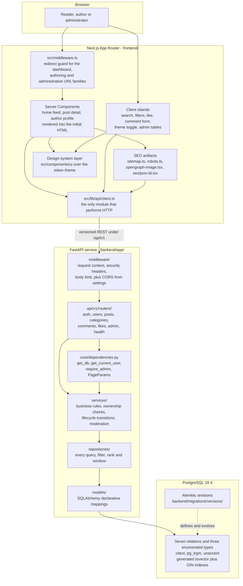
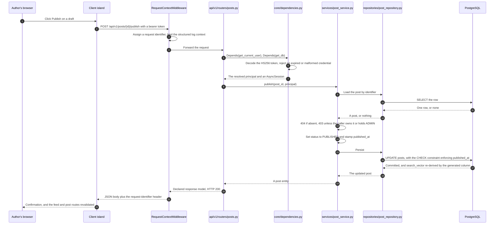
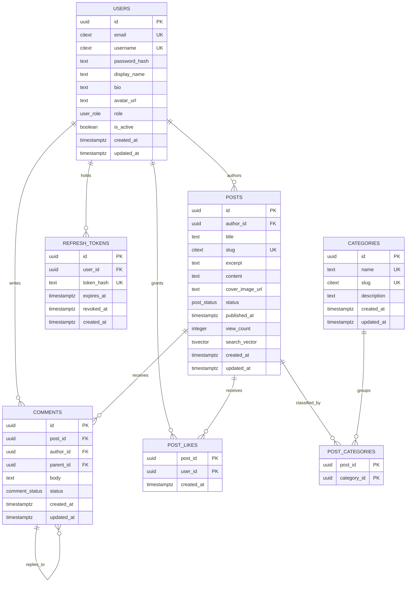

# Blog Platform — Architecture Reference

This repository is a two-tier monorepo. A FastAPI service in `backend/` owns the blog domain —
identity, posts, categories, comments and likes — over PostgreSQL, and a Next.js application in
`frontend/` owns presentation. The only coupling between them is a versioned REST contract under
`/api/v1`: the presentation tier holds no database credential, issues no SQL and shares no
in-process state with the service. This document explains *why* the system is shaped that way — the
tier boundaries, the request lifecycle, the data model, and the four decisions that were settled
before any code was written. Detail belongs to the specialised documents indexed under
[Where to go next](#where-to-go-next); this one covers structure and rationale.

## Tier boundaries



Two properties of that diagram are load-bearing. They are the point of the design rather than
incidental to it.

**Presentation never touches the database.** The REST contract is the only seam. No component, route
segment, layout or hook holds a connection string, and `DATABASE_URL` is a backend-only variable.
That single restriction is what makes the two tiers independently deployable and independently
testable: the service can be exercised end to end with an in-process HTTP client and no browser, and
the presentation tier can be exercised against mocked responses and no database.

**No route handler contains a query.** Every handler resolves its dependencies, calls a service and
returns a declared response model. Contrast the pre-change application, where the five handlers
mutated a module-level list directly — `items.append(item)`, `items[index] = updated_item` and
`items.pop(index)` at `app.py:L17,L38,L47` — and where the identity predicate
`if item.id == item_id:` was written independently three times, at `app.py:L29,L37,L46`. In the
target design that predicate lives once, in a repository method, and every caller inherits the same
behaviour when it changes.

### Backend layering

The layering is a rule, not a suggestion, and the dependency arrow points one way only.

| Layer | Directory | Owns | May not |
| --- | --- | --- | --- |
| Routes | `backend/app/api/v1/routers/` | HTTP shape: path, status, declared response model, dependency wiring | Contain data-access logic, or raise a framework exception directly |
| Services | `backend/app/services/` | Business rules, authority checks, lifecycle transitions, sanitisation | Build SQL, or read a request |
| Repositories | `backend/app/repositories/` | Every query, join, predicate, ordering and window | Contain a business rule |
| Models | `backend/app/models/` | Schema: columns, constraints, indexes, relationships | Hold a query or a session |

`backend/app/core/` is cross-cutting and imported by all four — configuration, security primitives,
dependencies, the exception hierarchy, logging, pagination, slug derivation and rate limiting.
`backend/app/middleware/` wraps every request and is registered once, by the application factory.

Two consequences are worth naming. First, an authority rule expressed in a service holds no matter
which entry point invokes it, and it is unit-testable without an HTTP request. Second, because the
feed's composition lives in exactly one place — `backend/app/repositories/post_repository.py` — the
statement that serves the home page, an author's profile listing, the author workspace and the
administrative tables is one statement with different arguments, so its index usage is predictable
rather than emergent.

### Frontend rendering split

The presentation tier is deliberately split rather than uniformly client-rendered.

**Server Components fetch during render**, so content lands in the initial HTML response. This is
not a preference; it is what makes the SEO requirement achievable at all. A crawler must not need to
execute client JavaScript to see an article, so the home feed, the post detail page and the author
profile are server-rendered and their bodies are present in the first byte stream.

**Client islands are isolated to the interactive pieces** — search, category filters, the like
control, the comment form, the theme toggle and the administrative tables. They call the API through
the shared client with the bearer token attached. Isolating them is what keeps a page from becoming
a client bundle merely because it carries a like button.

**Query state lives in the URL.** The feed reads `q`, `category`, `page` and `sort` from the
request's search parameters rather than from component state. Every result set is therefore
linkable, shareable, crawlable, and correct under browser back and forward navigation. The search
input debounces before pushing a new URL, so typing does not generate a request per keystroke.

### The single HTTP seam

`frontend/src/lib/api/client.ts` is the **only** module in the presentation tier that performs HTTP.
Route segments, layouts, client islands, hooks, providers, `frontend/src/app/sitemap.ts` and
`frontend/src/app/robots.ts` all reach the API *through* it and never around it. It owns:

- resolution of the API base URL, per rendering context;
- bearer-token attachment, and the browser-only in-memory credential store;
- a bounded deadline per attempt, because `fetch` has no timeout of its own;
- validation of every JSON body against the decoder its declared type ships with;
- refresh-on-unauthorised, with concurrent callers sharing one rotation;
- normalisation of every failure into one typed error.

The seven typed wrappers beside it — `auth`, `posts`, `categories`, `comments`, `likes`,
`users` and `admin` under `frontend/src/lib/api/` — add types and paths and nothing else. A wrapper
that branched on a status code or attached a header would have taken on transport logic that belongs
in the client. The concentration is the point: there is exactly one place where a credential is
attached, one where a rotation can race, one where a request can hang and one where a failure
becomes a typed error, and each of those is a defect class that cannot be distributed across dozens
of call sites if it exists only once.

## Request lifecycle: the publish path end to end

`POST /api/v1/posts/{id}/publish` is the most instructive single request in the system, because it
exercises nearly every layer and shows exactly where each responsibility lands.



### Decisions, not mechanics

Three things in that trace are decisions rather than plumbing, and each has a reason.

**Authority lives in the service, not the router.** The 404-if-absent and 403-unless-owner-or-
`ADMIN` checks sit in `backend/app/services/post_service.py`, expressed as
`viewer.id == post.author_id or is_admin(viewer)`. Placing them there means the same rule holds no
matter which entry point invokes the operation, and it means the rule can be unit-tested without
constructing an HTTP request. The router's whole contribution is to resolve dependencies and let the
registered handlers translate a typed domain error into a response.

**The `published_at` invariant is enforced by a database `CHECK` constraint**, not by application
code. `ck_posts_published_at_required` asserts `status <> 'PUBLISHED' OR published_at IS NOT NULL`,
so a bug in application code cannot produce a published post with no publication date. The predicate
is deliberately an implication rather than an equality: an archived post keeps the `published_at` it
earned, which an equality would forbid.

**The search index needs no maintenance step.** `posts.search_vector` is a *stored generated*
column, so committing the update re-derives it. There is no trigger, no queue, no application-side
index maintenance and no way for the index to fall behind the row it describes.

### The cross-cutting request envelope

Every request passes through the same chain. `add_middleware` inserts at the front, so the
first-registered middleware ends up innermost; the resulting nesting, outermost first, is:

| Layer | Module | Responsibility |
| --- | --- | --- |
| `RequestContextMiddleware` | `backend/app/middleware/request_context.py` | Assigns the request identifier, binds the structured log context, emits the access record, and returns the identifier as a response header |
| `SecurityHeadersMiddleware` | `backend/app/middleware/security_headers.py` | Baseline response headers, applied to preflights and to problem documents exactly as to a 200 |
| `CORSMiddleware` | Framework, configured from `settings.CORS_ALLOW_ORIGINS` | Cross-origin access for the browser-origin presentation tier |
| Error rendering | `backend/app/core/exceptions.py` | Renders a failure as a problem document while the CORS layer is still on the stack |
| `BodyLimitMiddleware` | `backend/app/middleware/body_limit.py` | Refuses an oversized body before anything reads it, inside every layer whose behaviour a refusal needs |

Each position is load-bearing rather than arbitrary. `RequestContextMiddleware` is registered last
so it is outermost and every request carries an identifier — including one that fails inside another
middleware. `SecurityHeadersMiddleware` sits outside `CORSMiddleware` because that middleware
answers an `OPTIONS` preflight itself and never calls the application beneath it, so anything
registered inside it would leave every preflight unhardened. `BodyLimitMiddleware` is registered
first, and therefore innermost, which puts every layer a refusal needs above it.

Rate limiting is attached with `slowapi`: the limiter is bound to the application, and the limits
are declared per route inside `backend/app/api/v1/routers/auth.py` rather than on the mount, because
registration and login are the routes that need them.

None of this existed before the change. The pre-change application registered no middleware of any
kind — no CORS configuration, no security headers, no request correlation and no rate limiting.

## Data model

Seven relations, three enumerated types and three extensions. The schema was designed against
PostgreSQL 18.4 and each guarantee below was confirmed by executing it, not by asserting it.



`post_categories` carries the many-to-many between posts and categories, and `comments.parent_id`
self-references so a reply is a comment like any other rather than a second kind of record.

### Enumerated types and extensions

Lifecycle is expressed as a native PostgreSQL enumerated type in all three cases, so an invalid
state is a write error rather than a value the application has to keep filtering out.

| Type | Members | Purpose |
| --- | --- | --- |
| `user_role` | `READER`, `AUTHOR`, `ADMIN` | Authority as an attribute of the record, so the administrative surface can be gated server-side. Defaults to `READER` at the database level |
| `post_status` | `DRAFT`, `PUBLISHED`, `ARCHIVED` | Three distinct states rather than a boolean, with publish and unpublish as explicit transitions |
| `comment_status` | `PENDING`, `APPROVED`, `REJECTED` | Moderation as a state an administrator can change, so "managing comments" has something to manage |

Three extensions are installed by the first revision, each because a specific guarantee depends on
it: `citext` for case-insensitive identity, `pg_trgm` for the `gin_trgm_ops` operator class the
trigram indexes need, and `unaccent` for text normalisation in the search configuration.

### Invariants the database holds

Each row below is a guarantee the schema enforces, together with the class of bug it removes from
application code. Every one was verified by execution against PostgreSQL 18.4.

| Guarantee | Mechanism | Bug class it removes |
| --- | --- | --- |
| A case-variant duplicate account cannot be registered, and `/u/Alice` and `/u/alice` resolve to one person | `citext` on `users.email`, `users.username`, `posts.slug` and `categories.slug`, behind unique indexes. Inserting `Alice` then `alice` is rejected with a unique violation | Every write path having to lower-case before comparing, and every read path having to remember to do the same |
| A published post always has a publication instant | `ck_posts_published_at_required`, asserting `status <> 'PUBLISHED' OR published_at IS NOT NULL`. Inserting a `PUBLISHED` row with a null `published_at` is rejected | An application bug on any publish path producing a post that is public with no date |
| Relevance search is always current and needs no maintenance | `posts.search_vector` is a **stored generated** column over `to_tsvector` with `setweight` — `'A'` for the title, `'B'` for the excerpt, `'C'` for the body — queried with `websearch_to_tsquery` and ordered by `ts_rank`, under a GIN index. A verified query returned the seeded row at rank `0.389` | A trigger to maintain, a reindex step to schedule, and an index that can silently fall behind its row |
| Liking is idempotent **by construction** | Composite primary key `(post_id, user_id)` on `post_likes`, with a conflict-ignoring insert. Two identical inserts leave the count at `1` | Application-level de-duplication on a retryable request, and an inflated count when a client retries. None exists, and none is needed |
| Identity is server-owned | `gen_random_uuid()` as the column default — a PostgreSQL 18 built-in, so no extension is required — supplied by the primary-key mixin in `backend/app/db/base.py` | The client being the source of identity, which is what let a duplicate identifier be stored and permanently shadow later records |
| Dependent rows never outlive their parent | Explicit `ON DELETE CASCADE` on every foreign key. Deleting a post removes its comments and likes; deleting a user removes their posts, comments, likes and refresh tokens | Orphan-sweeping code on every delete path, and the referential drift that follows when one path forgets |

Typo tolerance is a fallback rather than the primary path. The feed's predicate is a disjunction —
the full-text match *or* a trigram similarity match on the title — so a misspelt term still finds
the post it meant.

### Index strategy

The pre-change system had no index of any kind: every addressed operation was a first-match linear
scan in which a miss traversed the whole collection. The schema replaces that with explicit access
paths.

| Object | Type | Serves |
| --- | --- | --- |
| Unique indexes on `users.email` and `users.username` | `citext` unique | Registration conflict detection and profile lookup by username |
| Unique indexes on `posts.slug` and `categories.slug` | `citext` unique | Canonical URL resolution, which is what makes a stable public URL possible |
| `ix_posts_search_vector` | GIN | The feed's ranked full-text path, and the primary search route |
| `ix_posts_title_trgm`, and the sibling trigram indexes on the other searched columns | GIN, `gin_trgm_ops` | The typo-tolerant fallback, and anchored prefix matching for slug collision detection |
| `ix_posts_status_published_at` over `(status, published_at DESC)` | B-tree | The home page's primary query: recent published posts |
| Index on `posts.author_id` | B-tree | Profile listings and the author workspace |
| `post_categories` composite primary key, plus an index on `category_id` | B-tree | Category filtering in both directions |
| Composite index on `comments (post_id, created_at)`, plus one on `comments.status` | B-tree | Threaded retrieval for a post, and the moderation queue |
| Unique index on `refresh_tokens.token_hash`, plus lookup indexes on `user_id` and `expires_at` | B-tree | Rotation, revocation and expiry sweeps |

#### Index selection at volume

A planner that declines an index on a small relation is costing the query correctly; what would be a
defect is an index the predicate can never reach. That distinction was worth measuring, because
`EXPLAIN` against a single-row probe table chose a sequential scan for the ranked search path —
which looks like a missing index and is not.

`backend/tests/integration/test_post_search_filter_pagination.py` closes the question and gates it.
It plans each half of the feed's predicate and the whole disjunction, at volumes from one row to
several thousand, always after `ANALYZE`, never with `enable_seqscan` disabled, and finds that the
ranked full-text path moves to a bitmap scan over `ix_posts_search_vector`, the default recency
path uses `ix_posts_status_published_at`, and the disjunction plans as a bitmap-or across both GIN
indexes. One condition turned out to be load-bearing: a GIN index created with `fastupdate` on — the
default — buffers new entries in a pending list that every scan must read in full, so a bulk load
inside one transaction leaves the index in a state no queried index is really in and inflates its
cost several fold. The test drains that list, exactly as autovacuum does continuously in a running
system, so its verdicts do not depend on execution order.

### Migration chain and the reversibility contract

Three revisions, applied in order, each a distinct step for a reason.

| Revision | Contents |
| --- | --- |
| `backend/migrations/versions/0001_initial_blog_schema.py` | Installs `citext`, `pg_trgm` and `unaccent`; creates the `user_role`, `post_status` and `comment_status` types; creates all seven relations with their primary keys, unique constraints, foreign keys with explicit cascade, the publication check constraint and the B-tree indexes |
| `backend/migrations/versions/0002_post_search_vector_and_indexes.py` | Adds the generated `search_vector` column and creates the GIN full-text and trigram indexes. Kept separate so the index build is a distinct, re-runnable step rather than a clause buried in the schema creation |
| `backend/migrations/versions/0003_seed_reference_categories.py` | Inserts the reference category set as data, so a freshly migrated environment can exercise category filtering immediately instead of presenting an empty control |

Every revision ships a working `downgrade`. The contract is validated as a cycle rather than
asserted:

```bash
alembic upgrade head     # apply every revision to an empty database
alembic downgrade base   # prove every revision is reversible
alembic upgrade head     # and that the reversal left nothing behind
alembic check            # prove the models and the schema have not drifted
```

`alembic check` is the half that keeps the two definitions honest. Autogeneration compares the
mapped metadata against the live schema with `compare_type` and `compare_server_default` both
enabled, so a column type or a server default that exists in one place and not the other is a
failure rather than a surprise at deployment.

All four commands run from `backend/`, which is the canonical working directory:
`backend/alembic.ini` resolves `script_location` and `prepend_sys_path` against the process working
directory, so an invocation from anywhere else stops immediately with a diagnosable error rather
than a half-resolved configuration.

### One source of truth for the connection URL

`backend/alembic.ini` carries the script location and the logging configuration, and deliberately
declares **no** `sqlalchemy.url`. The omission is a requirement rather than an oversight.
`backend/migrations/env.py` instead imports the metadata from `backend/app/db/base.py` and reads the
connection URL from the settings object, and imports `app.models` so autogeneration sees every
mapped class. Three properties follow: the application and its migrations share one connection URL
and one metadata view, no credential is ever committed to a tracked configuration file, and there is
exactly one declarative base and one `MetaData` in the backend — a mapped class registered against a
second one would be invisible to autogeneration and to every relationship that needed it.

## Architectural decisions

Four questions had to be answered before implementation could be deterministic. All four are
settled, and each is recorded here with the evidence that drove it and the consequences that follow.

### FastAPI, not Django

The requirement named a Python backend and allowed either framework. The decisive evidence is that
the repository was *already* a FastAPI application: the application object was constructed as
`app = FastAPI()` at `app.py:L4`, the framework and its ASGI server were the only declared
dependencies (`README.md:L2`), and the request contract was already expressed as a Pydantic model
(`app.py:L2,L9-L12`). Choosing Django would have meant discarding the only source file the project
had, replacing its one dependency statement, and abandoning the generated OpenAPI description that
was the project's only machine-readable contract. FastAPI honours the instruction to *improve* what
existed and preserves every line of intent that was still valid.

Four secondary decisions follow from the framework rather than from the requirement, and they are
recorded here so they are not re-litigated later:

- **SQLAlchemy 2.0 with Alembic** provides the ORM and the migration tooling.
- **Pydantic v2 schemas** under `backend/app/schemas/` express request and response contracts.
- **The framework's dependency-injection system** carries authentication and authorisation, rather
  than decorators or per-view middleware. `Depends` appears nowhere in the pre-change code; it is
  now the single wiring mechanism.
- **There is no framework-provided administrative interface**, so the administrative dashboard is
  an explicit route group over an explicit API namespace. That is what the requirement asked for in
  any case — an admin dashboard as a deliverable, not an assumed framework feature.

### PostgreSQL replaces the in-memory store outright

The pre-change application stored every record in a module-level Python list, `items = []` at
`app.py:L6-L7`. There is no dual-write and no migration path, because there was nothing to migrate:
the measured recovery point was zero records recoverable after any process restart. The list was
removed, not drained.

This is also a correctness change and not only a durability one. Under two worker processes the
pre-change application returned divergent element counts for identical collection reads, and
alternating `404` and `200` for four identical reads of the *same* identifier, because each worker
held a private copy of the collection. Single-process operation was therefore a correctness
constraint rather than a tuning default. Moving the system of record into PostgreSQL is precisely
the change that makes multi-worker operation correct, which is why the production image runs
Gunicorn supervising Uvicorn workers.

### The launch entry point is corrected, not broken further

The documented launch command was `uvicorn main:app --reload` (`README.md:L3`), but no `main`
module ever existed — the application object lived in `app.py`. The documented procedure could not
succeed as written, which made this the one feature the project shipped in a non-functional state.

The resolution introduces a canonical package entry point at `backend/app/main.py` and retains the
repository-root `app.py` as a thin, explicitly deprecated shim that re-exports the application
object the factory builds. The shim holds no application code and no legacy behaviour — only the
import path — so the historical `uvicorn app:app` invocation from the repository root still resolves
and no external reference to the module breaks. Deleting `app.py` would have been simpler and worse.

**One operational caveat, and it is the reason the canonical form is what it is.** The shim resolves
the backend package only while the repository root is on the import path, which in practice means
only when the process working directory *is* the repository root. From anywhere else the name
resolves elsewhere, or not at all, and no code in the shim can intervene. The canonical, unambiguous
invocation is therefore:

```bash
cd backend && uvicorn app.main:app --reload
```

That is the form every artifact naming an entry point uses. `backend/Dockerfile` and
`docker-compose.yml` serve `app.main:app`, and `README.md` and the `Makefile` document the same
target. The bare `main:app` appears nowhere, because it never resolved.

### A design system is established because none was named

No component library or design system was specified, and there was nothing in the repository to
align to: no design token, theme, palette, typography scale, layout, breakpoint or accessibility
attribute was authored anywhere, and no frontend manifest of any kind existed. Rather than leave the
question open — which produces ad-hoc values at every call site — a system is established and all
presentation work is held to it. It has three parts:

1. **A token layer** authored in the styling engine's theme block in
   `frontend/src/app/globals.css`, declaring semantic tokens once and mapping them onto primitives.
   Each semantic token is declared twice, light and dark, so a component written against a semantic
   name themes automatically with no conditional logic.
2. **Unstyled accessible behavioural primitives** for every interactive widget, supplying focus
   trapping, roving focus, escape handling and the correct ARIA roles, so none of that is
   hand-rolled.
3. **A thin in-repository component layer** at `frontend/src/components/ui/`, which *is* the
   project's design system. Feature code consumes it and never reaches past it to a raw interactive
   element.

The token catalogue, the light and dark value pairs, and the theme-selection mechanism belong to
[features/theming-dark-mode.md](features/theming-dark-mode.md) rather than here.

## Transformation of the pre-change surface

The pre-change five-route `/items` surface is **not** migrated, wrapped or maintained in parallel.
It is superseded.

| Before | After |
| --- | --- |
| Five unversioned `/items` routes, none declaring a response model (`app.py:L15-L49`) | Thirty-seven operations under an explicit `/api/v1` prefix, plus two unprefixed probes, every one declaring a response model |
| One `Item` model with a client-supplied identifier (`app.py:L9-L12`) | The seven-relation blog domain, with server-generated UUID identity |
| `items = []`, a module-level list, process-local and non-durable (`app.py:L6-L7`) | PostgreSQL 18.4 as the system of record, evolved by Alembic revisions |
| A launch command naming a module that never existed (`README.md:L3`) | The canonical `uvicorn app.main:app` from `backend/`, with the repository-root shim retained for the historical invocation |

### Retirement, not compatibility

After the change, `GET /items` returns `404` and no `/items` path appears in the generated OpenAPI
document. That is asserted, not assumed: `backend/tests/integration/test_openapi_contract.py` walks
the served document and holds the single authoritative enumeration of the API surface, checked
against the application's own route table.

No compatibility endpoint is provided for the item resource, and this is deliberate. No consumer of
it could exist, because the data never survived a process restart — there was never a stable
collection for a client to depend on. Providing a shim would have meant maintaining a contract with
no counterparty.

### Response-contract corrections

Three inconsistencies in the pre-change contract are corrected. The endpoint-by-endpoint reference,
including the full pagination, filtering and error contracts, belongs to
[api/rest-endpoints.md](api/rest-endpoints.md); what matters architecturally is the shape.

| Concern | Before | After |
| --- | --- | --- |
| Single-resource shape | Mutating routes wrapped results in a `message`/`data` envelope (`app.py:L18,L39`) while reads returned bare payloads (`app.py:L23`) | Bare resource representations for single reads, so one response shape serves reads and writes alike |
| Collection shape | A bare list, with no total, no window and no way to page | One page envelope for every list surface, carrying `items`, `total`, `page`, `page_size` and `pages`, so a single pagination component serves the feed, profiles and the administrative tables |
| Errors | The same ad-hoc raise written three times, `HTTPException(status_code=404, detail="Item not found")` at `app.py:L31,L40,L49` | One machine-readable problem document, served as `application/problem+json` per RFC 9457. Services raise typed domain errors; handlers registered once in `backend/app/core/exceptions.py` render every failure through one implementation |

## Runtime, configuration and observability

### Pinned runtime versions

Three runtimes, each pinned to an exact patch version rather than a major line, because a
reproducible install is worth more than an automatic upgrade.

| Runtime | Version | Where the pin is declared |
| --- | --- | --- |
| Python | `3.14.7` | `backend/.python-version`, `backend/pyproject.toml`, `backend/Dockerfile` |
| Node.js | `24.19.0` | `frontend/.nvmrc`, the `engines` field in `frontend/package.json`, `frontend/Dockerfile` |
| PostgreSQL | `18.4` | `docker-compose.yml` |

Every other artifact that names a runtime — `README.md` and `.github/workflows/ci.yml` — must name
exactly these three versions, character for character. A disagreement between any two of these files
is a defect rather than a variation, because the whole value of an exact pin is that one lookup
answers the question everywhere. Dependencies are held to the same standard: every entry in
`backend/requirements.txt`, `backend/requirements-dev.txt` and `frontend/package.json` is pinned to
an exact version, with a resolved lockfile beside the last of them. The pre-change repository
declared no version of anything — its single dependency statement was the unpinned prose
`pip install fastapi uvicorn` (`README.md:L2`), which did not even name Pydantic despite
`app.py:L2` importing it.

### Configuration surface

`backend/app/core/config.py` is a `pydantic-settings` model and the **only** reader of the
environment. Every other module imports the settings object; none reads a variable directly, and no
secret, connection string or origin list is hard-coded anywhere. The pre-change application read no
environment variable at all, so this is the first configuration surface the project has had.

`.env.example` is the documented contract, and it is the authoritative list — this document
deliberately does not duplicate it, because a second enumeration is a second thing to keep current.
It covers two groups: the backend variables, which include the connection URL, the token signing
material and lifetimes, the permitted browser origins, the logging and rate-limit settings and the
seed administrator identity; and the `NEXT_PUBLIC_`-prefixed presentation variables, which carry
the API base URL, the canonical site origin and the site name. `.gitignore` excludes `.env` and
every local variant while keeping `.env.example` tracked — the negation is placed after the
catch-all deliberately, because the last matching pattern wins — so only placeholder values are ever
committed.

Two validated constraints are worth naming because they fail startup rather than degrading quietly:

- **`DATABASE_URL` must use the `postgresql+psycopg://` scheme.** One driver serves both the
  application's async engine and Alembic's synchronous connection, so a second driver never enters
  the connection surface.
- **`JWT_SECRET_KEY` must be at least as long as the configured algorithm's digest** — 32 bytes
  for the default `HS256`, and more for the wider variants. Startup refuses a shorter key rather
  than warning about it, which is the same comparison the token library makes before objecting, and
  the requirement RFC 7518 §3.2 states. The measurement is in bytes rather than characters, so a
  passphrase of non-ASCII characters encodes to more than it appears to. The placeholder committed
  in `.env.example` clears the floor so a freshly copied file starts, and is rejected outright
  outside a local environment precisely because it is published here.

### Dependency-injection wiring points

Concentrating the wiring is a deliberate design property, not an accident of layout. Each concern
has exactly one place to look.

| Wiring point | What is registered there |
| --- | --- |
| `backend/app/main.py` | OpenAPI title, version, description and tag metadata; CORS from settings; the middleware chain; the versioned router and the unprefixed health router; every exception handler; the rate limiter; and a lifespan that configures logging on the way in and disposes the connection pool on the way out |
| `backend/app/core/dependencies.py` | `get_db`, which yields a request-scoped `AsyncSession` and guarantees close; `get_current_user` and `get_current_active_user`; `require_admin`; and `PageParams`, which normalises and bounds the pagination inputs for every list endpoint |
| `backend/app/api/v1/router.py` | The domain routers, with their prefixes and tags applied on the include — eight includes over seven modules, because comments span two path families. The version prefix is written exactly once, on the aggregate itself, so no route can escape it by omission |
| `backend/app/models/__init__.py` | Every mapped class, re-exported so Alembic autogeneration and the application share one metadata view |
| `backend/migrations/env.py` | The migration environment: application metadata, and the connection URL from settings |
| `frontend/src/app/layout.tsx` | The provider stack, nested theme then query then session, plus the toast host, the document shell and the root metadata |
| `frontend/src/lib/api/client.ts` | Base URL resolution, credential attachment, rotation on unauthorised, and error normalisation |

### Observability

Structured logging is present from the first request rather than retrofitted. `structlog` renders
records as JSON outside development and human-readably inside it, configured once in
`backend/app/core/logging.py` and applied identically by the service and by the migration runner.
`backend/app/middleware/request_context.py` binds a request identifier into that context for the
duration of each request and returns it as a response header, so a client-visible failure and the
server-side records that explain it can be correlated without guesswork. The pre-change application
emitted no log record of any kind.

Liveness and readiness are **separate** probes, both mounted unprefixed and outside `/api/v1`,
because an orchestrator has to be able to probe a process before anything has told it which API
version to speak.

| Probe | Semantics | Why it is distinct |
| --- | --- | --- |
| `GET /healthz` | Answers `200` from the process alone and performs no database work | It answers "is this process alive, and should it be restarted". A database outage must not cause every replica to be killed and rescheduled, which is exactly what would happen if liveness depended on a query. `backend/Dockerfile`'s `HEALTHCHECK` targets this probe for that reason |
| `GET /readyz` | Answers `200` only when a trivial query succeeds | It answers "should traffic be sent here". A replica that cannot reach the database should be removed from rotation and left running, not destroyed |

### Authorisation is defence in depth

`frontend/src/middleware.ts` keeps a visitor with no session out of the dashboard, authoring and
administrative URL families before any component renders, and the client hides controls a role
cannot use. **Neither is a security boundary.** Both exist so a reader is redirected instead of
watching a screen fail, and nothing more.

The frontend guard authenticates nothing, and the reason is worth stating precisely, because
assuming otherwise is how a real vulnerability gets introduced. It **verifies no signature and
decodes no token** — it holds no signing key, performs no crypto and parses no JWT. `JWT_SECRET_KEY`
is a backend-only value, and shipping it into a browser bundle to validate a credential client-side
would be the vulnerability this design avoids. What the guard reads is a role marker written for
exactly this purpose, which authenticates nothing and proves nothing: a visitor who edits it to
claim `ADMIN` buys a redirect and no authority whatsoever. The access token itself is never placed
in a cookie a script can read; it lives only in the in-memory store inside
`frontend/src/lib/api/client.ts`, and the credential that lets a fresh document recover a session
is an `HttpOnly` cookie written server-side by `frontend/src/app/api/session/route.ts`, which the
guard cannot see even in principle.

Because route-group parentheses never appear in a URL, the guarded families are the URL paths
`/dashboard/:path*`, `/posts/:path*` and `/admin/:path*` — not the `(dashboard)` and `(admin)`
directory names that organise the route tree.

Every protected operation is therefore re-checked server-side, in one of two ways:

- **`require_admin`, applied at router level** on the administrative namespace in
  `backend/app/api/v1/router.py`. That placement is load-bearing: a gate on the mount covers every
  operation beneath it, including one added long after the gate was written, so the guarantee is a
  property of the composition rather than an act of remembering per route. It is the single
  router-level application of the gate in the service.
- **An ownership assertion in the service layer**, for row-scoped authority. A coarse role gate
  answers "may this principal use this namespace"; it never answers "may this principal do this to
  this row". `backend/app/services/post_service.py` and `backend/app/services/comment_service.py`
  answer the second question, and the administrative service re-checks authority on each of its own
  methods too, because a service reachable from a script is a service whose guard must not live only
  in its caller.

## Standards this document is held to

`review_rules` reports that **no user-specified rules were provided** for this project. No rule
governs this document or the architecture it describes, and none is invented here. Their absence is
not licence to lower the bar: the work is held instead to the thirteen self-imposed enterprise
standards recorded in **§0.10.1 of the Agent Action Plan**, which that plan describes as binding.
Seven of them govern this document directly, and each is discharged above rather than merely cited.

| Standard (AAP §0.10.1) | Where this document accounts for it |
| --- | --- |
| Layered separation of concerns | [Backend layering](#backend-layering), including the pre-change defect it remedies |
| Server-owned identity and database-enforced integrity | [Invariants the database holds](#invariants-the-database-holds) |
| Reversible schema evolution | [Migration chain and the reversibility contract](#migration-chain-and-the-reversibility-contract) |
| Day-one observability | [Observability](#observability) |
| Configuration from the environment only | [Configuration surface](#configuration-surface) |
| No secrets in the repository | [Configuration surface](#configuration-surface) |
| Pinned, reproducible dependencies | [Pinned runtime versions](#pinned-runtime-versions) |

## Where to go next

This document explains structure and decisions. The detail lives in the specialised documents beside
it, and is deliberately not restated here.

| Document | Covers |
| --- | --- |
| [api/rest-endpoints.md](api/rest-endpoints.md) | The endpoint reference, and the pagination, filtering and error contracts in full |
| [features/authentication.md](features/authentication.md) | Registration, credential verification, token issuance and rotation, revocation, and the role model |
| [features/posts.md](features/posts.md) | The post lifecycle, slug derivation, ownership rules, and the feed's search, filtering and pagination |
| [features/comments-and-likes.md](features/comments-and-likes.md) | Threaded comments, moderation states, idempotent likes, and the share affordances |
| [features/categories.md](features/categories.md) | The taxonomy, its lifecycle, and how the filter control is driven |
| [features/admin-dashboard.md](features/admin-dashboard.md) | The administrative namespace and the management screens over users, posts, comments and categories |
| [features/seo.md](features/seo.md) | Canonical URLs, per-route metadata, structured data, the sitemap and the crawl policy |
| [features/theming-dark-mode.md](features/theming-dark-mode.md) | The token catalogue, the light and dark value pairs, and theme selection and persistence |
